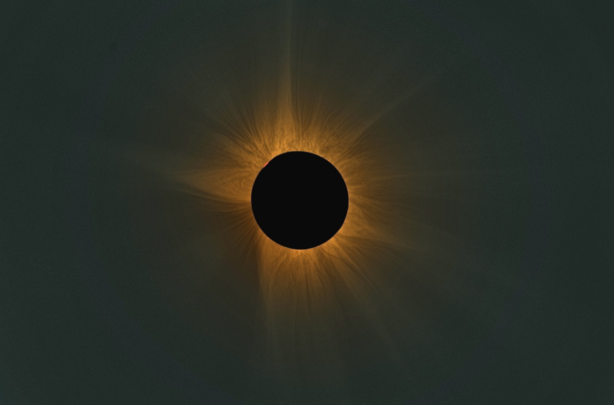
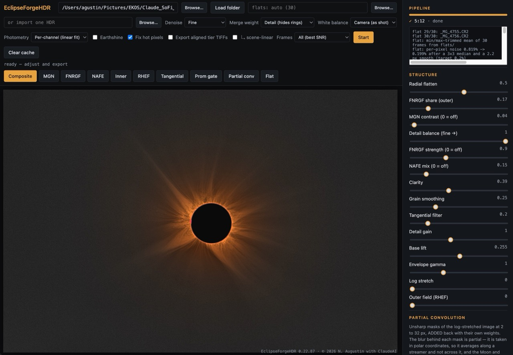
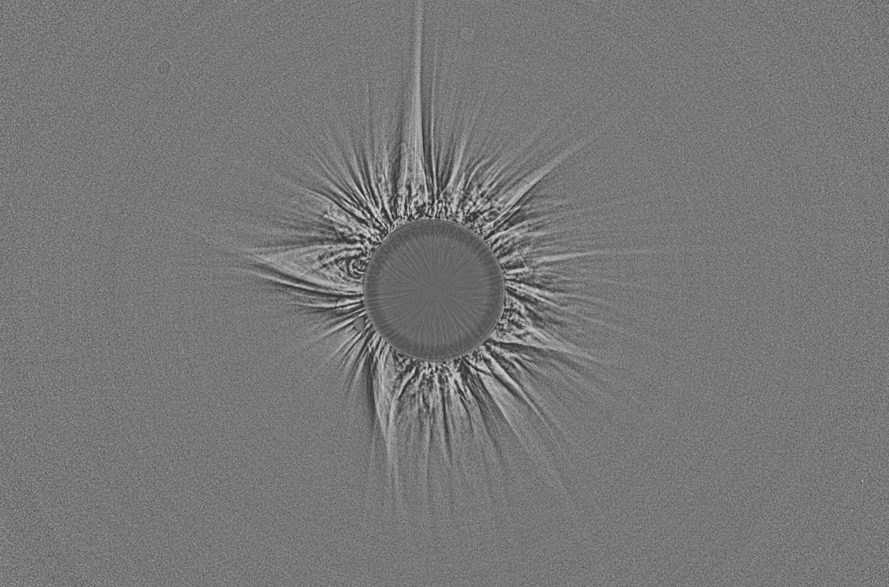
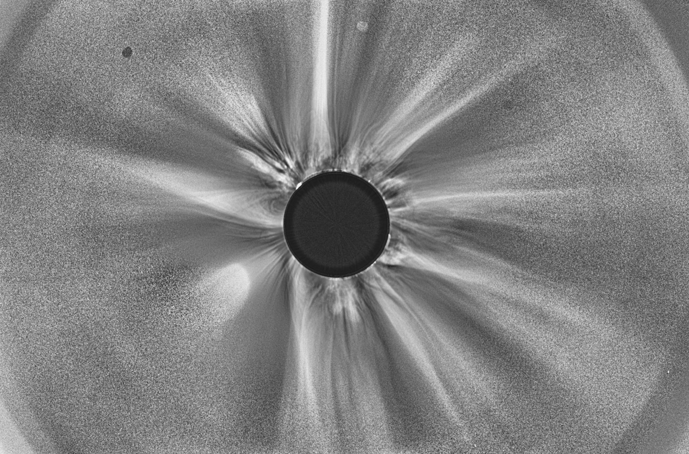
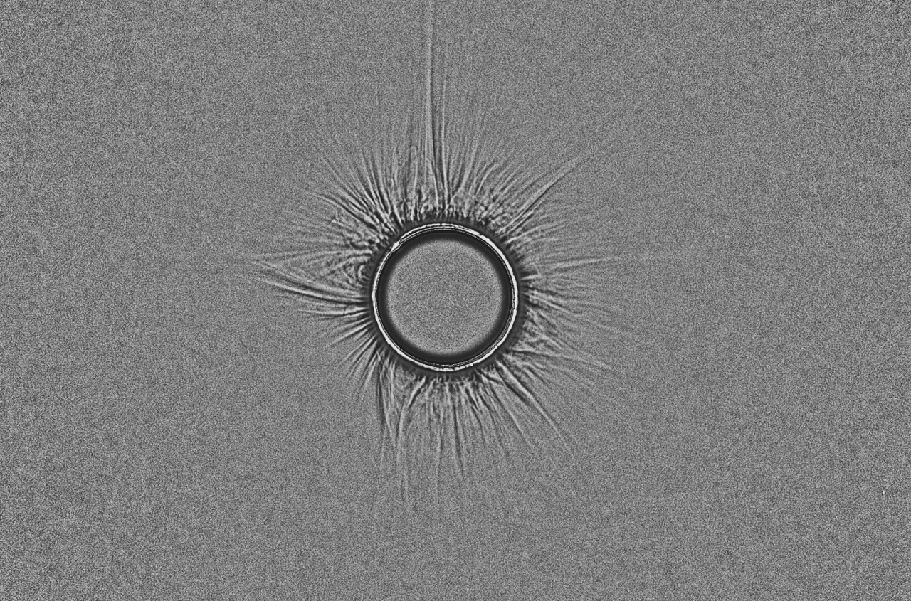
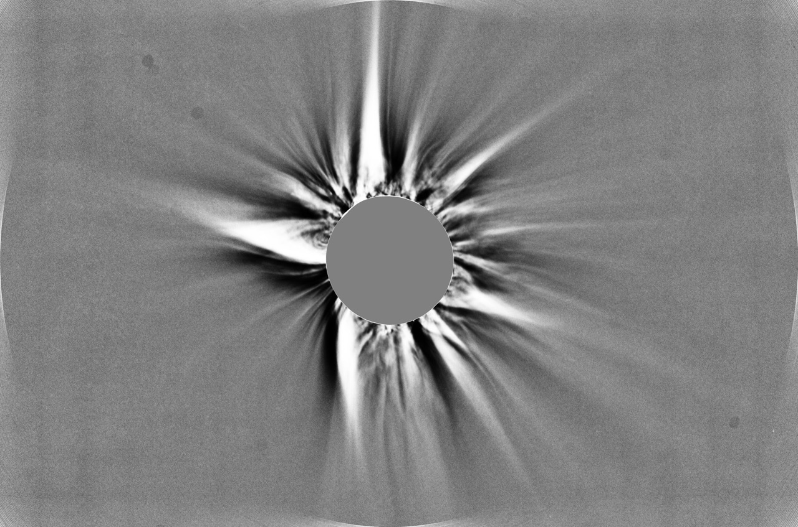
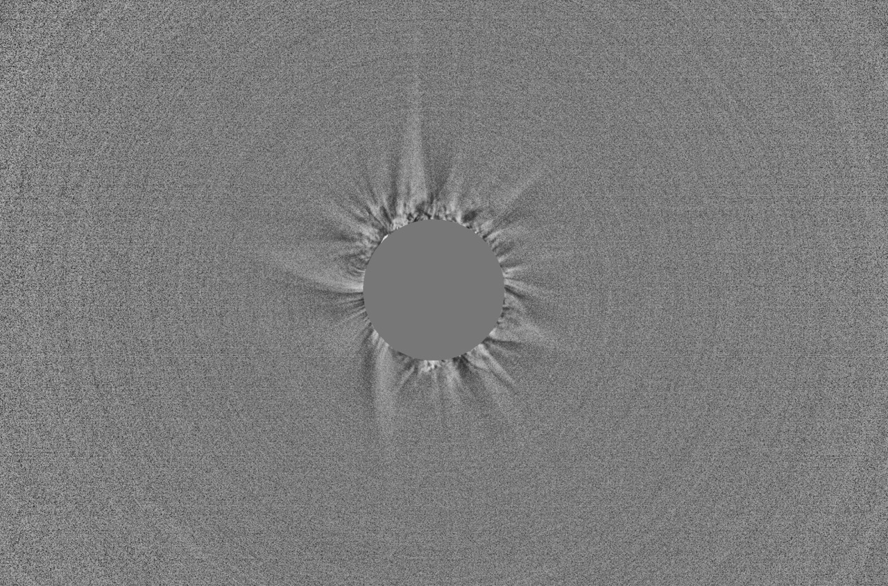
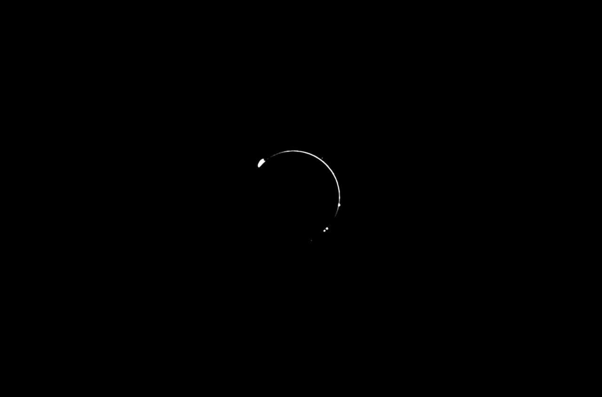
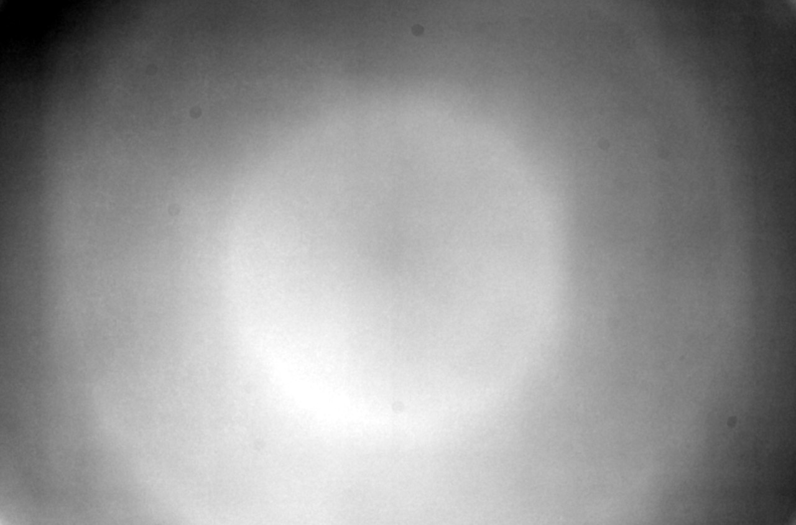

# EclipseForgeHDR

**High-Dynamic-Range Solar Eclipse Image Processing** — version 0.22.28

A local desktop app that turns a folder of exposure-bracketed raw files shot
during totality into a finished corona image. Point it at the folder, wait
a few minutes, then adjust the result on a live preview and export it.

Everything runs on your own machine. No cloud, no account, no telemetry: the
GUI is a small web server on `127.0.0.1` that only your browser talks to.

*49 frames, 14 exposure tiers, 12.6 EV — Panasonic S1R II at 600 mm f/8,
Spain, 12 August 2026.*

*The whole interface. The folder and the flats go in the top bar; the row of
buttons switches the preview between the composite and each individual layer;
every slider on the right re-renders live, with no re-processing.*

---

## What it is

A purpose-built corona pipeline. It knows that the subject is a solar corona
around an occulting Moon — a smooth radial brightness falloff of ~10,000:1 with
faint structure riding on top — and every stage is built around that fact
rather than around stars.

## What it is not

- **Not a general astrophotography stacker.** No star registration, no plate
  solving, no deconvolution, no dark frames, no dithering or drizzle. (Flats
  it does take — see [Flat-field calibration](#flat-field-calibration).) If
  you want DeepSkyStacker, Siril or PixInsight's workflow, use those.
- **Not a raw developer.** It does its own demosaic, white balance and colour
  transform straight from the sensor data. It is not a Lightroom replacement
  and does not read your develop settings.
- **Not for partial phases.** It expects frames taken during totality; frames
  showing a bright crescent are detected and dropped.
- **Not rotation-aware (yet).** Cross-tier alignment solves translation only.
  On an equatorial mount that is exactly right. On an untracked or alt-az set
  spanning a long totality there will be residual field rotation it cannot
  remove.
- **Not a mosaic or multi-camera tool.** One camera, one focal length, one
  bracket set per run.
- **Not finished, and not licensed yet.** Source-available rather than open
  source — see [Licence](#licence). No support promised, and no guarantee that
  any constant in it is right for *your* data.

---

## How it works

The pipeline runs once per folder and caches everything, so re-rendering and
exporting afterwards is instant.

1. **Read and group.** Raw files are decoded, grouped into exposure tiers by
   EXIF shutter speed, and hot/dead photosites are mapped on the shortest tier
   and repaired everywhere. If a `flats/` folder is present, a master flat is
   built from it and divided out of every frame first — see
   [Flat-field calibration](#flat-field-calibration).
2. **Score and average.** Every frame is scored for sharpness. Frames within a
   tier are aligned to each other sub-pixel and averaged (√N noise gain), or
   you can keep only the sharpest. Frames that are not totality — a bright
   partial-phase crescent, say — are rejected by their saturated area.
3. **Align the tiers.** The hard part. Each tier is flattened radially and
   log-scaled so the corona's own gradient stops dominating the correlation,
   then phase-correlated against its neighbours. Links are built redundantly
   (each tier to the next *and* to the one after) and the whole network is
   solved by weighted least squares, so one bad pair cannot drag the set.
   Where prominences are detectable they are located automatically and matched
   by normalised cross-correlation, adding independent hard anchors to the same
   network. Residuals are measured and reported.
4. **Cross-calibrate.** Overlapping tiers are compared over regions selected by
   signal-to-noise, giving a photometric factor per tier so the exposures agree
   on absolute brightness rather than just nominal shutter speed.
5. **Merge.** A saturation-weighted merge in linear colour: each tier
   contributes where it is neither clipped nor noise-dominated, with soft
   weights so there are no seams. Where it measurably helps, each tier is also
   masked to its own lunar disc, since the Moon moves against the corona during
   the bracket.
6. **Trim, and flatten the sky.** The alignment border — the strip that only
   some tiers cover — is cropped away automatically. At low solar altitude the
   sky itself is not uniform across a 3.5° field; a low-order surface is fitted
   per channel *beyond the measured corona extent* and divided out, which
   takes the sky's colour gradient with it, so the gradient goes
   without the corona's own asymmetry going with it.
7. **Extract structure.** Several independent enhancement layers are computed
   from the merged HDR: MGN (multi-scale Gaussian normalisation), FNRGF
   (Fourier normalising radial-gradient filter), NAFE-VN (noise-adaptive fuzzy
   equalisation with a variable neighbourhood), a Pellett rotational unsharp
   mask, a short-exposure inner-corona/prominence layer, and an earthshine
   layer from the longest exposures.
8. **Render.** The GUI mixes those layers live over a decimated preview; when
   you like it, the same parameters are applied at full resolution and
   exported.

The published methods behind steps 3, 5 and 7 are Druckmüller (2009, 2013),
Druckmüllerová et al. (2011), Morgan, Habbal & Woo (2006), Morgan &
Druckmüller (2014) and Habbal, Druckmüller & Morgan (2014); deviations from
their published constants are noted in the code where they occur.

---

## The layers

Steps 7 and 8 above extract several independent views of the same merged image.
None of them is a filter you apply *instead of* the others — they see different
things, each has its own button in the GUI so you can look at it alone, and the
composite is a weighted mix. Broadly: MGN and Pellett are for fine structure,
FNRGF and NAFE for faint outer structure, and Inner and Prom gate are extra
*sources* rather than filters.

| MGN | FNRGF | NAFE |
|:---:|:---:|:---:|
|  |  |  |
| **Pellett** | **Inner** | **Prom gate** |
|  |  |  |

*The same merged image through each layer. These are the GUI's own view
buttons — every layer can be inspected alone before it is mixed.*

**MGN — Multi-scale Gaussian Normalisation** (Morgan & Druckmüller 2014)
Normalises local contrast at six spatial scales at once: at each scale it
divides out the local mean and scales by the local standard deviation, then
recombines. The corona's brightness spans four orders of magnitude, and MGN
makes structure equally visible at the bright base and out in the faint
streamers. It is the workhorse — fine plumes, streamer filaments, the fine
radial texture — and it is what most published corona images lean on. Its
weakness is the disc edge, where a normalising kernel straddling the limb has
nothing sensible to normalise against.
*Sliders: MGN contrast, Clarity, Grain smoothing.*

**FNRGF — Fourier Normalising Radial Gradient Filter** (Druckmüllerová, Morgan
& Habbal 2011)
Removes the radial falloff. At each radius it fits a low-order Fourier series in
azimuth to both the mean brightness and its spread, then normalises against that
model. Because the model varies *around* the disc rather than being a single
number per ring, it follows the corona's real east–west asymmetry instead of
fighting it. Strongest in the outer corona, where the falloff is the dominant
signal; it is mixed in progressively with radius rather than applied everywhere.
*Sliders: FNRGF strength, FNRGF share (outer).*

**NAFE — Noise Adaptive Fuzzy Equalisation** (Druckmüller 2013)
A local histogram equalisation, but with the neighbourhood defined in *value*
rather than in space: a pixel is ranked against other pixels of similar
brightness, not against whatever happens to be nearby. The strength is limited
by the locally measured noise, so it lifts faint structure without amplifying
grain into it. It needs no disc geometry at all, which is why it stays clean
right at the limb where MGN and FNRGF are most fragile. Good at very faint
outer detail; off by default because it is easy to overdo.
*Slider: NAFE-VN mix.*

**Pellett — rotational unsharp mask**
Blurs the image along the azimuthal direction about the disc centre and
subtracts the result, in polar space. That enhances anything *radial* — plumes,
streamer spines, polar brushes — and suppresses anything that runs around the
disc, which is mostly artefacts. A small amount adds a lot of apparent
sharpness to the streamers; too much and the whole corona looks combed.
*Slider: Pellett layer.*

**Inner — short-exposure inner corona**
Not a filter but a separate source: its own stack of only the shortest
exposures, with its own MGN and its own lunar geometry. The inner corona is
exactly where the merged HDR is weakest — the steepest gradient, the largest
lunar smear across the bracket, the most glare — while the short frames were
never anywhere near clipping there and have a limb four times sharper. This
layer supplies crisp near-limb detail from those frames and is blended in over
a window around the disc.
*Sliders: Short-exposure detail, Detail denoise, Glare dim.*

**Prom gate — prominence mask**
Also not a filter but a mask, and the only layer that uses colour. Prominences
emit in H-alpha and are far redder than the corona, so the gate measures the
corona's own red-to-green-plus-blue ratio in a ring around the limb and
thresholds against a robust spread of that measurement — which makes it
independent of white balance and of the camera. The result is confined to a
narrow annulus above the limb. `Prominence contrast` then uses the mask to
modulate local contrast and brightness there, so prominences gain presence
without the rest of the image being touched.
*Slider: Prominence contrast.*

---

## Features

- Import a finished HDR instead of a bracket — one 16-bit TIFF or FITS from
  Siril, PixInsight or Photoshop gets every enhancement layer, with the tone
  curve read from the file's own colour profile
- Automatic tier detection, best-frame selection, hot-pixel repair
- The lunar disc is found from its limb *edge*, so nothing depends on focal
  length: it works from a disc filling 3% of the frame to one filling 30%, and
  it does not care whether the inner corona is lopsided
- Optional flat-field calibration from a `flats/` folder, with the master
  flat's own noise measured and the smoothing set from it
- Sub-pixel alignment within and across tiers, with prominence anchoring and a
  measured, reported error budget
- Photometric tier cross-calibration
- Seam-free saturation-weighted HDR merge in linear colour
- Per-tier lunar masking, applied only when it measurably improves the limb
- Automatic crop of the alignment border
- Six independent structure layers, each on its own slider and each viewable
  alone: MGN, FNRGF, NAFE-VN, Pellett, inner corona, prominences
- Earthshine layer from the longest exposures
- Diamond-ring blending from a separate contact frame
- Colour controls that separate sky cast from corona colour (measured, not
  guessed), plus warmth, tint, saturation, highlight compression
- Zoomable, pannable live preview; every parameter is a slider
- Export at full or half resolution as 16-bit TIFF, 8-bit TIFF, 16-bit PNG or
  JPG, each with a `.params.json` sidecar recording the exact settings
- Optional export of the **aligned exposure tiers** as 16-bit TIFFs with an
  embedded ICC profile (sRGB or scene-linear), for hand-blending or HDR
  combining in Photoshop, Affinity or PixInsight
- A written run report: alignment residuals, lunar drift, tier variance,
  calibration factors, and every gate the pipeline opened or closed
- Raw input from any Bayer camera LibRaw supports; 16-bit TIFF brackets and
  FITS (colour, mono or 3-plane) also accepted

---

## Platform

Nothing in the code is macOS-specific — it is Python, it binds a local web
server to `127.0.0.1` and opens your default browser, and all paths go through
`os.path`. It should run on **Windows and Linux** as well; every dependency
(numpy, scipy, scikit-image, Pillow, tifffile, rawpy, exifread, Flask) ships
wheels for all three. Only the install instructions below are Mac-flavoured;
on Windows or Linux, `pipx install /path/to/eclipseforgehdr` is the same command
without the `brew` line.

It has only actually been *run* on macOS, so treat other platforms as untested
rather than unsupported. The real constraint is not the OS but memory: a full
run holds every tier of a 45 MP bracket in RAM at once, so budget roughly
2 GB per 4 tiers at that resolution.

## Install

Clone it first:

    git clone https://github.com/naugustin77/EclipseForgeHDR.git
    cd EclipseForgeHDR

Recommended — pipx (isolated, easy to update):

    brew install pipx        # macOS. Linux: your package manager.
                             # Windows: py -m pip install --user pipx
    pipx ensurepath          # once; then open a new terminal
    pipx install .

To update:

    git pull
    pipx install --force .

Alternative — Homebrew, from the clone:

    ECLIPSEFORGE_SRC=$PWD brew install --formula ./formula/eclipseforgehdr.rb

Either way you get `eclipseforgehdr` (and the short alias `efhdr`) on PATH.

**Windows: if the first raw file fails with `DLL load failed while importing
_rawpy`**, rawpy's compiled part cannot load. Two causes, both with simple
fixes, and the app now names whichever applies:

- The **Microsoft Visual C++ Redistributable** is missing — a fresh Windows
  does not have it. Install
  [vc_redist.x64.exe](https://aka.ms/vs/17/release/vc_redist.x64.exe), reboot.
- You installed the **ARM64** build of Python (Windows on ARM, e.g. a VM on an
  Apple-silicon Mac). rawpy publishes no ARM64 wheel, so it can never load.
  Install the x86-64 Python from python.org instead — Windows on ARM runs it
  under emulation — and reinstall. FITS input needs no rawpy and works either
  way.

Raw decoding uses rawpy (bundled LibRaw). If your camera is newer than the
bundled LibRaw, install will still succeed but decoding may fail — then install
LibRaw from source (`brew install libraw --HEAD`) and `pipx install --force`
with `RAWPY_USE_SYSTEM_LIBRAW=1` set, or convert the raws to DNG first.

## Run

    eclipseforgehdr                    # opens http://127.0.0.1:8765
    eclipseforgehdr ~/Pictures/SoFi    # same, with the folder preloaded
    eclipseforgehdr --version

In the GUI: paste or edit the folder path, **Load folder**, **Start** (the
first run takes several minutes; progress is logged live), then adjust the
sliders on the preview (scroll = zoom, drag = pan, double-click = reset) and
**Export full resolution**. Switch folders at any time — each folder keeps its
own cache.

Heavy intermediates live in `.eclipseforgehdr/` inside the raw folder; outputs
land in `eclipseforge_output/` next to the raws.

## Importing a finished HDR

If you already have a merged corona image, you do not have to stack it here
again. Put its path in the box next to the flats box and press Start: the disc
is located, the sky gradient is fitted and removed, and MGN, FNRGF, NAFE-VN,
the inner-corona layer, Pellett and the prominence gate are all built on that
image. Every view exports exactly as it does from a bracket.

16-bit TIFF or FITS. **8-bit is refused** — the corona spans several thousand
to one and 8 bits cannot hold it.

The one thing that has to be right is linearity, and it is read from the file
rather than assumed: an embedded ICC profile declares the transfer function,
and the inverse is applied. An sRGB export therefore works correctly. A file
with no profile has to say `linear` in its name, or it is rejected rather than
guessed at.

What an imported image gives up, all of it stated in the report:

- no alignment, photometry or per-tier lunar masking, and no earthshine layer —
  those describe a stack, and there is no stack
- the **inner-corona layer stops being independent**. Normally it is a separate
  MGN of the shortest tiers, which see the inner corona unsaturated; from one
  image it is a second view of the same pixels
- the **prominence gate is weaker**. It keys on H-alpha redness in a fast tier,
  and a merged image has usually compressed exactly that: measured on the
  reference stack, R/GB reads 1.84 against 3.02 from the real fast tier

## Flat-field calibration

Optional, and inert unless you provide flats. Put them in a subfolder of the
raw folder called `flats/`:

    my_eclipse/
      P1072647.RW2 ...      <- the bracket
      flats/
        P1072775.RW2 ...    <- the flats

Load the folder and the status line says how many it found. The box next to the
folder path takes a different location if your flats live elsewhere, or the word
`off` to ignore a `flats/` folder that is there. Flats are never mistaken for
light frames — only files sitting directly in the raw folder are read as
lights.

A master flat is built once, cached, and divided out of every frame of every
tier before anything else touches it. It removes lens vignetting, the cos⁴
falloff, dust shadows on the sensor stack, and per-photosite sensitivity
(PRNU). This matters more for an eclipse than for most subjects, because the
corona's own radial falloff *is* the signal: a 6% vignette is a 6% error in the
F-corona gradient, and MGN, FNRGF and NAFE-VN all then work to preserve it.

**How much the master is smoothed is measured, not chosen.** Dividing by a flat
injects that flat's own noise into every frame identically, so stacking cannot
average it away — twenty flats exposed at 12% of full well carry over 1% noise
per photosite, which applied to correct a 6% vignette would put more noise in
than gradient out. So the flats are split into two independent half-stacks,
whose difference *is* the master's noise, and the smoothing radius is raised
until that measured number falls under 0.2% per photosite. The log and the run
report say what happened:

    flat: min/max-trimmed mean of 20 frames from flats/
    flat: per-pixel noise 1.318% -> 0.183% after a 5.7 px smooth (target 0.2%)
    flat: corrects a 8.4% falloff — the dimmest part of the field sits at
          0.923 of the brightest

A clean, well-exposed set therefore keeps its dust motes at full resolution;
a thin or under-exposed one degrades to a vignetting model rather than adding
noise. **More flats and brighter flats both buy sharper correction** — if you
want dust removed as well as vignetting, expose them to roughly half of
saturation and shoot plenty.

*The master flat itself, on the GUI's **Flat** button. It is stretched to its
own 0.5–99.5 percentile, because a falloff of a few percent shown linearly over
0–1 is invisible — and seeing it is the point of this view. Visible here: the
vignette, a brightest point sitting below and left of the frame centre rather
than on it, and a scatter of dust motes. All of it is divided out of every frame
of every tier. Worth a look before you trust a flat set; it is the one place a
bad one announces itself.*

Practical notes:

- Each flat is normalised **per Bayer channel to the centre of the frame**, so
  the master cannot shift your white balance or your overall level, only the
  spatial structure. Illumination colour drifting between flats cancels.
- The per-pixel combine drops the highest and lowest sample (5 flats or more),
  so a satellite, an aircraft or a cosmic ray in one flat does not survive.
- Unusable flats are named and skipped: exposed above 85% of saturation (on the
  shoulder of the sensor's response), below 2% (too dark to calibrate with), or
  a different frame size from the lights. If no master can be built, the run
  says so and continues uncorrected.
- Sky flats, wall flats, panel flats — anything uniform. Dust that has moved
  since the flats were taken will be corrected in the wrong place; if that
  worries you, that is an argument for fewer, brighter flats, since the
  smoothing then does less to hide it either way.

This is separate from the sky-gradient fit. Vignetting is radial about the
frame centre and fixed by the optics; the low-altitude sky gradient is a tilted
plane fixed by the atmosphere, and on the reference set a radial model explains
0.0% of it. Both run, and each is reported separately.

## FITS input

Folders of FITS frames work as input, for capture software that writes it
rather than camera raw — INDI/EKOS, SharpCap, N.I.N.A., FireCapture. Colour
(CFA + `BAYERPAT`), monochrome, and already-debayered 3-plane cubes are all
handled; the Bayer pattern is rolled to RGGB and `XBAYROFF`/`YBAYROFF` are
respected.

`EXPTIME` or `EXPOSURE` is **required** — it is what groups frames into
exposure tiers, so it cannot be guessed. `DATE-OBS`, `GAIN`, `PEDESTAL` and
`SATURATE` are used when present.

Three things to know. FITS headers carry no colour matrix and no white balance,
so the frames stay in raw sensor colour through the merge — inventing one
earlier would hide a colour error inside the photometry. A sensor is far more
sensitive in green than in red, though, so raw-sensor white is not white, and
left alone it comes out blue-cyan. The balance is therefore measured **after**
the merge, from the inner corona: the K-corona is sunlight scattered off free
electrons, and that scattering is wavelength-independent, so the inner corona
carries the Sun's own spectrum. It is the one thing in the frame that is white
by physics rather than by convention.

FITS also cannot say which way up the camera was. `ROWORDER` describes row
order, not camera rotation, and there is no orientation keyword in the format —
so a portrait-shot bracket arrives on its side, and nothing in a corona can
reveal that. Use **Orientation** with the export settings; it applies to the
view and the export, costs no re-run and changes nothing in the report.

And where no `SATURATE` keyword exists the saturation ceiling is recovered from
the data — a real ceiling shows as a minority of pixels sharing the maximum —
with the bit depth as a fallback; the run report says which was used.

Reading needs no extra package: there is a built-in reader for plain
uncompressed FITS, which is what cameras write. `astropy` is used automatically
if installed and covers tile-compressed files and the stranger corners of the
standard:

    pipx install '.[fits]'      # or: pip install astropy

## TIFF input

Folders of 16-bit TIFF brackets work as input too (e.g. Lightroom exports of
the raws). Files must keep their EXIF — `ExposureTime` is required for tier
detection. TIFFs are assumed sRGB/display-gamma and are linearised
automatically; for linear input set `ECLIPSEFORGE_TIFF_LINEAR=1` or put
"linear" in the filenames. Camera raws remain the recommended, highest-quality
path — TIFF input exists for preprocessed workflows and unsupported cameras.

---

---

## Licence

Source-available, **not open source**: copyright is reserved and no licence has
been granted yet — see [LICENSE](LICENSE) for the full text. In short:

- **Run it on your own images, for anything.** Modify your copy. Open issues and
  pull requests.
- **The images you make with it are entirely yours.** No rights claimed, no
  royalty, no attribution required. Sell the prints, license the photographs,
  publish them. The restriction is on the software, and it does not reach
  through to your pictures.
- **Not granted:** redistributing the code outside GitHub, publishing modified
  versions, bundling it into a product, selling it, or offering it as a service.
  Ask — the answer is likely yes with conditions.

The intent is that people should be free to use and improve this without paying,
that nobody should be able to sell it or close it off, and that improvements
stay available on the same terms. No widely used software licence expresses
exactly that, so rather than pick a poor fit in a hurry it stays unlicensed
while the question is open. Suggestions are welcome in an issue.

## Methods and references

The enhancement layers implement published methods. Where this code deviates
from a paper's constants, the deviation is marked in the source at the point it
happens.

- M. Druckmüller, "Phase correlation method for the alignment of total solar
  eclipse images", *ApJ* **706**, 1605 (2009) — the alignment approach.
- M. Druckmüller, "A noise adaptive fuzzy equalization method for processing
  solar extreme ultraviolet images", *ApJS* **207**, 25 (2013) — NAFE.
- M. Druckmüller and H. Druckmüllerová, "Adaptive fuzzy equalization with
  variable neighbourhood", *IWCIA 2014*, LNCS 8466, 262 — the variable
  neighbourhood in value space.
- H. Druckmüllerová, H. Morgan and S. R. Habbal, "Enhancing coronal structures
  with the Fourier normalizing-radial-graded filter", *ApJ* **737**, 88 (2011) —
  FNRGF.
- H. Morgan, S. R. Habbal and R. Woo, "The depiction of coronal structure in
  white-light images", *Solar Physics* **236**, 263 (2006) — NRGF, the ancestor
  of the above.
- H. Morgan and M. Druckmüller, "Multi-scale Gaussian normalization for solar
  image processing", *Solar Physics* **289**, 2945 (2014) — MGN.
- S. R. Habbal, M. Druckmüller and H. Morgan, in *IWCIA 2014* — the published
  NAFE working values used as this code's defaults.
- P. E. Debevec and J. Malik, "Recovering high dynamic range radiance maps from
  photographs", *SIGGRAPH* (1997) — the saturation-weighted HDR merge.
- H. S. Malvar, L. He and R. Cutler, "High-quality linear interpolation for
  demosaicing of Bayer-patterned color images", *ICASSP* (2004) — the demosaic.

If this is useful in published work, please cite the papers above for the
methods and link this repository for the implementation.

## Changelog

The full history, newest first, is in [CHANGELOG.md](CHANGELOG.md).
