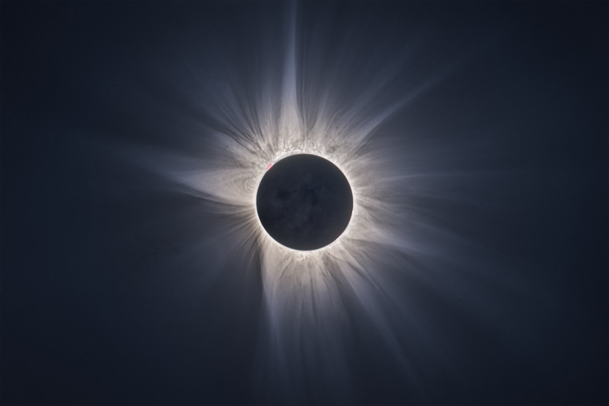
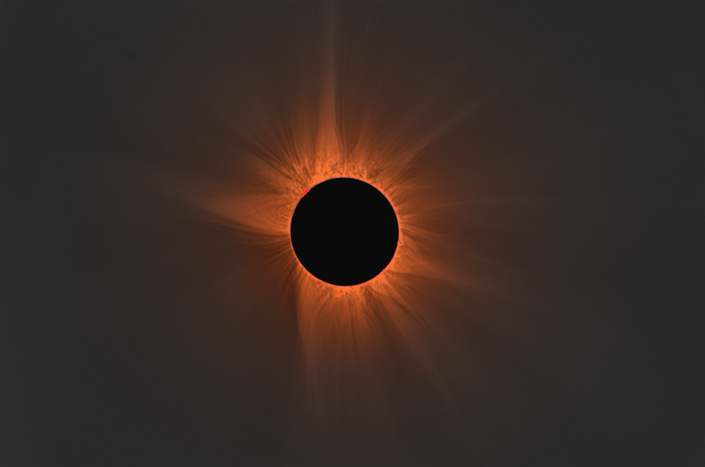
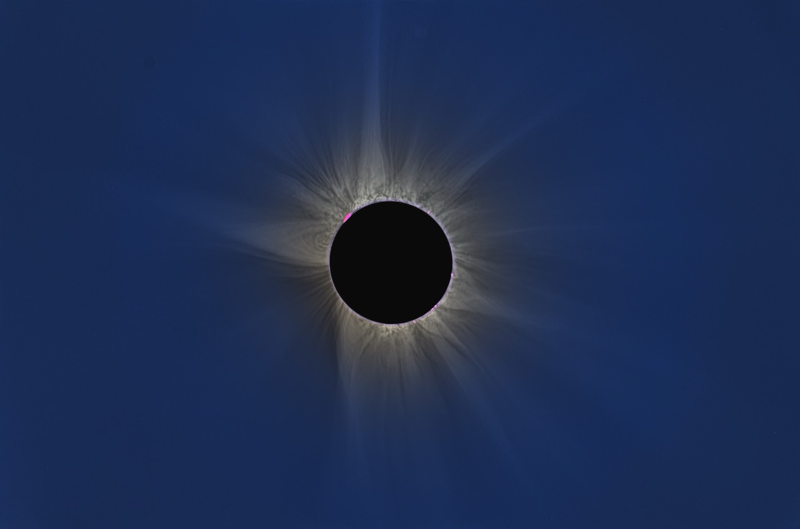

# EclipseForgeHDR

**High-Dynamic-Range Solar Eclipse Image Processing** — version 0.23.1

*41 raw frames, 12 exposure tiers, 9.6 EV — Panasonic LUMIX S1R II at 600 mm
f/8, Spain, 12 August 2026. Aligned, stacked and enhanced in EFHDR v0.23.1,
then finished by hand: NoiseXTerminator and mild curve adjustments in
PixInsight, and in Photoshop the prominences added back, the earthshine pulled
from the 0.5 s tier, some vignetting and colour work. EFHDR produced the merged
corona underneath all of that; the rest is ordinary photographic finishing on
top of it.*

A local desktop application that turns a folder of exposure-bracketed raw files
shot during totality into a finished corona image. Point it at the folder, wait
a few minutes, then adjust the result on a live preview and export it.

Everything runs on your own machine. No cloud, no account, no telemetry: the
interface is a small web server on `127.0.0.1` that only your browser talks to.

| | |
|:---:|:---:|
|  |  |
| **As the camera saw it** | **Neutralise corona** |

*The same merged image, one control apart. The corona is scattered photospheric
light and is very nearly white; at 6.8 degrees of solar altitude the atmosphere
takes the blue out of it on the way down, which is the warm cast on the left.
Neutralise corona measures the colour in a 1.05-1.6 R annulus and divides it
out. What that leaves visible on the right is the sky's own light, which this
version does not remove — see Known issues in the release notes.*

*41 frames, 12 exposure tiers, 9.6 EV — Panasonic S1R II at 600 mm f/8,
Spain, 12 August 2026.*

*The folder and the flats go in the top bar; the row of buttons switches the
preview between the composite and each individual layer; every slider on the
right re-renders live, with no re-processing.*

*A different bracket from the one above: 9 frames, 9 exposure tiers, 8.0 EV —
Canon EOS Rebel T7 with an EF-S 55-250 mm at 240 mm f/5.6. Image (c) a second tester
Brown, 2026, used with permission; one of the sets this release is validated
against.*

---

## What it is

A purpose-built corona pipeline. It assumes the subject is a solar corona around
an occulting Moon — a smooth radial brightness falloff of roughly 10,000:1 with
faint structure on top — and every stage is built around that rather than around
stars.

## What it is not

- **Not a general astrophotography stacker.** No star registration, plate
  solving, deconvolution, dark frames, dithering or drizzle. (Flats it does
  take — see [Flat-field calibration](#flat-field-calibration).)
- **Not a raw developer.** It does its own demosaic, white balance and colour
  transform from the sensor data, and does not read your develop settings.
- **Not for partial phases.** It expects frames taken during totality; frames
  showing a bright crescent are detected and dropped.
- **Not rotation-aware.** Cross-tier alignment solves translation only. On an
  equatorial mount that is correct. On an untracked or alt-az set spanning a
  long totality, residual field rotation remains.
- **Not a mosaic or multi-camera tool.** One camera, one focal length, one
  bracket per run.
- **Not finished, and not licensed yet.** Source-available rather than open
  source — see [Licence](#licence).

---

## How it works

The pipeline runs once per folder and caches its results, so re-rendering and
exporting afterwards are immediate.

1. **Read and group.** Raw files are decoded and grouped into exposure tiers by
   EXIF shutter speed. Hot and dead photosites are mapped on the shortest tier
   and repaired everywhere. If a `flats/` folder is present, a master flat is
   built and divided out of every frame first.
2. **Score and average.** Every frame is scored for sharpness. Frames within a
   tier are aligned to each other sub-pixel and averaged (√N noise gain), or you
   can keep only the sharpest. Non-totality frames are rejected by their
   saturated area.
3. **Align the tiers.** Each tier is flattened radially and log-scaled so the
   corona's own gradient does not dominate the correlation, then correlated
   against its neighbours. Links are redundant (each tier to the next *and* to
   the one after) and the network is solved by weighted least squares, so one
   bad pair cannot drag the set. Detectable prominences are located and matched
   by normalised cross-correlation, adding independent anchors to the same
   network. Residuals are measured and reported.
4. **Cross-calibrate.** Overlapping tiers are compared over regions selected by
   signal-to-noise, giving a photometric factor per tier, so exposures agree on
   absolute brightness rather than on nominal shutter speed.
5. **Merge.** A saturation-weighted merge in linear colour: each tier
   contributes where it is neither clipped nor noise-dominated, with soft
   weights so there are no seams. Where it measurably helps, each tier is also
   masked to its own lunar disc, since the Moon moves against the corona during
   the bracket.
6. **Trim and flatten the sky.** The alignment border — the strip only some
   tiers cover — is cropped automatically. At low solar altitude the sky is not
   uniform across a 3.5° field, so a low-order surface is fitted per channel
   *beyond the measured corona extent* and divided out. That removes the sky's
   colour gradient without removing the corona's own asymmetry.
7. **Extract structure.** Several independent enhancement layers are computed
   from the merged HDR: MGN, FNRGF, NAFE-VN, a tangential (rotational) unsharp
   mask, a partial-convolution unsharp chain, a short-exposure inner-corona
   layer, and an earthshine layer from the longest exposures.
8. **Render.** The interface mixes those layers live over a decimated preview;
   the same parameters are then applied at full resolution and exported.

The published methods behind steps 3, 5 and 7 are Druckmüller (2009, 2013),
Druckmüllerová et al. (2011), Morgan, Habbal & Woo (2006), Morgan & Druckmüller
(2014) and Habbal, Druckmüller & Morgan (2014). Deviations from their published
constants are noted in the code where they occur.

---

## The layers

Steps 7 and 8 extract several independent views of the same merged image. They
are not alternatives to each other: each sees different structure, each has its
own button so it can be inspected alone, and the composite is a weighted mix.
MGN, Tangential and Partial conv are for fine structure, FNRGF and NAFE for
faint outer structure, and Inner and Prom gate are additional *sources* rather
than filters.

| MGN | FNRGF | NAFE |
|:---:|:---:|:---:|
|  |  |  |
| **Tangential** | **Inner** | **Prom gate** |
|  |  |  |

*The same merged image through each layer.*

**MGN — Multi-scale Gaussian Normalisation** (Morgan & Druckmüller 2014)
Normalises local contrast at six spatial scales at once: at each scale it
divides out the local mean, scales by the local standard deviation, then
recombines. The corona spans four orders of magnitude, and MGN makes structure
equally visible at the bright base and in the faint streamers. It carries most
of the fine detail — plumes, streamer filaments, radial texture. Its weakness is
the disc edge, where a normalising kernel straddling the limb has nothing
sensible to normalise against.
*Sliders: MGN contrast, Clarity, Grain smoothing.*

**FNRGF — Fourier Normalising Radial Gradient Filter** (Druckmüllerová, Morgan &
Habbal 2011)
Removes the radial falloff. At each radius it fits a low-order Fourier series in
azimuth to both the mean brightness and its spread, then normalises against that
model. Because the model varies *around* the disc rather than being one number
per ring, it follows the corona's east–west asymmetry instead of fighting it.
Strongest in the outer corona, and mixed in progressively with radius rather
than applied everywhere.
*Sliders: FNRGF strength, FNRGF share (outer).*

**NAFE — Noise Adaptive Fuzzy Equalisation** (Druckmüller 2013)
A local histogram equalisation with the neighbourhood defined in *value* rather
than in space: a pixel is ranked against other pixels of similar brightness, not
against whatever is nearby. Its strength is limited by the locally measured
noise, so it lifts faint structure without amplifying grain. It needs no disc
geometry, which is why it stays clean at the limb where MGN and FNRGF are most
fragile. Off by default, as it is easy to overdo.
*Slider: NAFE mix.*

**Tangential — rotational unsharp mask**
Blurs the image along the azimuthal direction about the disc centre and
subtracts the result, in polar space. This enhances radial structure — plumes,
streamer spines, polar brushes — and suppresses anything running around the
disc, which is mostly artefacts. A small amount adds considerable apparent
sharpness.
*Slider: Tangential filter.*

**Partial conv — partial-convolution unsharp chain**
Unsharp masks of the log-stretched image at 2, 4, 8, 16 and 32 px, added back
with weights 1 / 0.6 / 0.2 / 0.1 / 0.05. Two things separate it from the layers
above. The blur behind each mask is taken in *polar* coordinates, so it averages
along a streamer rather than across it. And it is *partial*: the occulted disc
and the prominences are excluded from both the convolution and its
normalisation, so nothing is smeared out of them into the corona. It is also
additive and linear where MGN, NAFE and RHEF are multiplicative and locally
normalised — faint structure stays faint instead of being lifted to the same
texture as everything else. A noise threshold, set against a per-pixel
photon-noise model, keeps the far field from being embossed by its own grain.
After Jonathan Hill, "Advanced Solar Eclipse Photography".
*Sliders: the Partial convolution group. Off by default.*

**Inner — short-exposure inner corona**
A separate source rather than a filter: its own stack of the shortest exposures,
with its own MGN and lunar geometry. The inner corona is where the merged HDR is
weakest — steepest gradient, largest lunar smear across the bracket, most glare
— while the short frames were never near clipping there and have a limb four
times sharper. This layer supplies crisp near-limb detail and is blended in over
a window around the disc.
*Sliders: Short-exposure detail, Detail denoise, Glare dim.*

**Prom gate — prominence mask**
A mask rather than a filter, and the only layer that uses colour. Prominences
emit in H-alpha and are far redder than the corona, so the gate measures the
corona's own red-to-green-plus-blue ratio in a ring around the limb and
thresholds against a robust spread of that measurement, making it independent of
white balance and of the camera. The result is confined to a narrow annulus
above the limb. `Prominence contrast` then uses the mask to modulate local
contrast and brightness there.
*Slider: Prominence contrast.*

---

## Features

- Import a finished HDR instead of a bracket — one 16-bit TIFF or FITS from
  Siril, PixInsight or Photoshop gets every enhancement layer, with the tone
  curve read from the file's own colour profile
- Automatic tier detection, best-frame selection, hot-pixel repair
- The lunar disc is found from its limb *edge*, so nothing depends on focal
  length: it works from a disc filling 3% of the frame to one filling 30%
- Optional flat-field calibration from a `flats/` folder, with the master flat's
  own noise measured and the smoothing set from it
- Sub-pixel alignment within and across tiers, with prominence anchoring and a
  measured, reported error budget
- Photometric tier cross-calibration
- Seam-free saturation-weighted HDR merge in linear colour
- Per-tier lunar masking, applied only when it measurably improves the limb
- Automatic crop of the alignment border
- Six independent structure layers, each on its own slider and each viewable
  alone: MGN, FNRGF, NAFE-VN, tangential filter, partial convolution,
  inner corona, prominences
- Earthshine layer from the longest exposures
- Diamond-ring blending from a separate contact frame
- Colour controls that separate sky cast from corona colour, plus warmth, tint,
  saturation and highlight compression
- Zoomable, pannable live preview; every parameter is a slider
- Export at full or half resolution as 16-bit TIFF, 8-bit TIFF, 16-bit PNG or
  JPG, each with a `.params.json` sidecar recording the exact settings
- Optional export of the **aligned exposure tiers** as 16-bit TIFFs with an
  embedded ICC profile (sRGB or scene-linear), for hand-blending or HDR
  combining in Photoshop, Affinity or PixInsight
- A written run report: alignment residuals, lunar drift, tier variance,
  calibration factors, and every gate the pipeline opened or closed
- Raw input from any Bayer camera LibRaw supports; 16-bit TIFF brackets and FITS
  (colour, mono or 3-plane) also accepted

---

## Before you install

EFHDR is a Python program. It runs on **macOS, Windows and Linux** — everything
it needs (numpy, scipy, scikit-image, Pillow, tifffile, rawpy, exifread, Flask)
ships ready-built for all three. Testing so far has been on macOS and Windows;
treat Linux as untested rather than unsupported.

The one real requirement is **memory**. A run holds every tier of the bracket in
RAM at once: budget roughly 2 GB per 4 tiers at 45 MP, so a deep bracket from a
high-resolution camera wants 16 GB.

The install is the same three steps on either platform — get Python, get `pipx`,
then install EFHDR with it. `pipx` puts the app in its own private environment,
so it cannot disturb anything else on your machine and can be removed cleanly
later with `pipx uninstall eclipseforgehdr`.

You do **not** need Git or a GitHub account.

## Install on macOS

**1. Install Homebrew.** Skip this if you already have it. Open **Terminal**
(Applications → Utilities → Terminal), paste this line and press Enter:

    /bin/bash -c "$(curl -fsSL https://raw.githubusercontent.com/Homebrew/install/HEAD/install.sh)"

It asks for your password and may install Apple's command line tools first,
which takes a few minutes. When it finishes it prints two or three lines
starting with `eval` — run those, or simply quit Terminal and open it again.

**2. Install pipx.** This brings its own Python with it:

    brew install pipx
    pipx ensurepath

Quit Terminal and open a new window, so the changed PATH takes effect.

**3. Download EFHDR.** On the
[project page](https://github.com/naugustin77/EclipseForgeHDR), click the green
**Code** button, then **Download ZIP**. Double-click the downloaded file to
unpack it.

**4. Install it.** In Terminal type `cd ` — with a space after it — then **drag
the unpacked folder onto the Terminal window**, which fills in the path for you.
Press Enter, then:

    pipx install .

**5. Start it:**

    eclipseforgehdr

Your browser opens at `http://127.0.0.1:8765`.

## Install on Windows

**1. Install Python.** Download it from
[python.org/downloads](https://www.python.org/downloads/) — not from the
Microsoft Store. On the first screen of the installer, tick **"Add python.exe to
PATH"** before clicking Install.

On a Windows-on-ARM machine (Surface and similar), choose the **64-bit x86-64**
build rather than the ARM64 one. Raw decoding has no ARM64 version at all;
Windows runs the x86-64 build under emulation and everything works.

**2. Install pipx.** Open **PowerShell** from the Start menu and run:

    py -m pip install --user pipx
    py -m pipx ensurepath

Close PowerShell and open a new window.

**3. Install the Visual C++ Redistributable.** A fresh Windows does not have it
and raw decoding cannot load without it. Download and run
[vc_redist.x64.exe](https://aka.ms/vs/17/release/vc_redist.x64.exe), then
reboot.

**4. Download EFHDR.** On the
[project page](https://github.com/naugustin77/EclipseForgeHDR), click the green
**Code** button, then **Download ZIP**. Right-click the downloaded file and
choose **Extract All**.

**5. Install it.** In PowerShell type `cd ` — with a space after it — then
**drag the extracted folder onto the PowerShell window** and press Enter,
followed by:

    pipx install .

**6. Start it:**

    eclipseforgehdr

Your browser opens at `http://127.0.0.1:8765`.

## Updating

Download the new ZIP, unpack it, `cd` into it the same way, and:

    pipx install --force .

If you would rather use Git, `git clone` the repository once and then update
with `git pull` followed by the same `pipx install --force .`.

macOS users who prefer Homebrew can install from a clone instead:

    ECLIPSEFORGE_SRC=$PWD brew install --formula ./formula/eclipseforgehdr.rb

## If something goes wrong

**`eclipseforgehdr: command not found`** — `pipx ensurepath` has not taken
effect yet. Close the terminal window and open a new one. On Windows, log out
and back in if a fresh PowerShell still cannot find it.

**Windows: `DLL load failed while importing _rawpy`** — raw decoding cannot
load. Either the Visual C++ Redistributable is missing (step 3 above), or you
installed the ARM64 build of Python, which has no raw support and never will.
The app says which one applies. FITS input needs neither and works either way.

**Your camera is newer than the bundled raw decoder** — the install succeeds but
decoding fails. The simple fix is to convert the raws to DNG first; Adobe's DNG
Converter is free. On macOS you can instead build the current decoder:

    brew install libraw --HEAD
    RAWPY_USE_SYSTEM_LIBRAW=1 pipx install --force .

## Run

    eclipseforgehdr                     # opens http://127.0.0.1:8765
    eclipseforgehdr ~/Pictures/eclipse  # same, with the folder preloaded
    eclipseforgehdr --version

`efhdr` is a short alias for all of these.

In the interface: paste or edit the folder path, **Load folder**, **Start** (the
first run takes several minutes; progress is logged live), then adjust the
sliders on the preview (scroll to zoom, drag to pan, double-click to reset) and
**Export full resolution**. Switch folders at any time — each folder keeps its
own cache.

Intermediates live in `.eclipseforgehdr/` inside the raw folder; outputs land in
`eclipseforge_output/` next to the raws.

## Processing settings — what to change, and when

The defaults are what the measurements in this repository were made on. Leave
them alone unless one of the cases below describes what you are looking at. Each
setting is recorded in the run report, so two runs can always be compared, and
each is part of the cache key, so changing one re-stacks rather than serving a
stale result.

**Simple stack** — the fallback. Align, average each exposure group, measure the
exposure ratios from the pixels and merge. No dark, no flat, no hot-pixel
repair, no photometric ladder, no LDIC, no feather. Every stage that can fail on
an awkward bracket is absent, so a set the normal path cannot handle still gives
a clean stack, and the result gets all the usual enhancement layers.

*Use it when* the normal path gives you something obviously wrong and you want a
picture rather than a diagnosis — or as a control, to find out whether a problem
is in the merge or in the data. It also subtracts each frame's own corner level
per channel, which removes the sky as well as the black level.

*Its limit:* one number per frame cannot follow a sky that varies across the
frame. On a narrow field it works; on a wide one expect colour blotches in the
far outer corona. Judge it by eye.

**Correlation** — how two frames are matched during alignment.

- *Semi-phase (default).* The cross-power spectrum divided by the two amplitude
  spectra plus a small constant, so the whitening has a noise floor. Measured on
  a bench that injects an exact shift into realistic tiers: 1.187 px rms error
  and a 0.041 px pull toward zero shift, against 1.524 px and 0.200 px for plain
  cross-correlation. The pull is the estimator locking onto what both frames
  share — dust, fixed pattern, the lunar edge.
- *Cross-correlation.* What 0.23.1 and earlier did. Pick it to reproduce an
  older run.
- *Full phase.* Complete whitening. Weights every spatial frequency equally,
  including those carrying only read noise, and measures worse on a 14-stop
  bracket. Present for comparison.

**Align filter** — the high-pass applied before correlating.

- *Isotropic (default).* Subtracts a blurred copy.
- *Tangential.* Subtracts a copy blurred along a Sun-centred arc, so anything
  constant around a circle cancels — including the radial gradient and, in
  principle, the moving saturation edge. Measured 12% better than plain
  correlation and 2% better than semi-phase, which is inside the spread of 33
  samples: a real candidate, not a proven win. *Try it if* the alignment section
  of the report shows a large residual.

**Tier combine** — how the frames within one exposure group are combined.

- *Mean (default).* Every frame counts.
- *Clipped mean (κσ).* Rejects per-pixel outliers against a fitted noise model.
  On a tier carrying a cosmic-ray hit it cut the resulting error from 19864 ADU
  to 9.3. It needs every frame of a tier in memory at once, so it costs RAM.
  *Use it if* you have a satellite trail, an aircraft, or a particle strike in
  one frame of one tier.

**FNRGF** — the order of the Fourier fit in that detail layer.

- *EFHDR, order 6 with a hard cutoff (default).*
- *Published, order 30 with attenuation.* The setting the published papers
  describe. A higher order lets the fitted background follow finer azimuthal
  structure, so more of that structure is treated as background and removed:
  measured on a real bracket it keeps **less** structure than order 6 at every
  radius, for the same ring fraction. That is the expected direction, not a
  fault. *Use it if* the background behind the streamers looks lumpy and you are
  willing to trade contrast for smoothness.

## Importing a finished HDR

If you already have a merged corona image, it does not have to be stacked again.
Put its path in the box next to the flats box and press Start: the disc is
located, the sky gradient is fitted and removed, and MGN, FNRGF, NAFE-VN, the
inner-corona layer, the tangential filter and the prominence gate are all built
on that image.
Every view exports exactly as it does from a bracket.

16-bit TIFF or FITS. **8-bit is refused** — the corona spans several thousand to
one, and 8 bits cannot hold it.

Linearity has to be right, and it is read from the file rather than assumed: an
embedded ICC profile declares the transfer function and the inverse is applied,
so an sRGB export works correctly. A file with no profile must say `linear` in
its name, or it is rejected rather than guessed at.

What an imported image gives up, all of it stated in the report:

- no alignment, photometry or per-tier lunar masking, and no earthshine layer —
  those describe a stack, and there is no stack
- the **inner-corona layer stops being independent**. Normally it is a separate
  MGN of the shortest tiers, which see the inner corona unsaturated; from one
  image it is a second view of the same pixels
- the **prominence gate is weaker**. It keys on H-alpha redness in a fast tier,
  and a merged image has usually compressed exactly that: on the reference
  dataset, R/GB reads 1.84 against 3.02 from the real fast tier

## Flat-field calibration

Optional, and inert unless flats are provided. Put them in a subfolder of the
raw folder called `flats/`:

    my_eclipse/
      frame_0001.RW2 ...    <- the bracket
      flats/
        flat_0001.RW2 ...   <- the flats

Load the folder and the status line reports how many were found. The box next to
the folder path takes a different location if the flats live elsewhere, or the
word `off` to ignore a `flats/` folder that is present. Flats are never mistaken
for light frames: only files sitting directly in the raw folder are read as
lights.

A master flat is built once, cached, and divided out of every frame of every
tier before anything else touches it. It removes lens vignetting, the cos⁴
falloff, dust shadows on the sensor stack, and per-photosite sensitivity (PRNU).
This matters more for an eclipse than for most subjects, because the corona's
own radial falloff *is* the signal: a 6% vignette is a 6% error in the F-corona
gradient, and MGN, FNRGF and NAFE-VN then all work to preserve it.

**The amount of smoothing applied to the master is measured, not chosen.**
Dividing by a flat injects that flat's own noise into every frame identically,
so stacking cannot average it away. Twenty flats exposed at 12% of full well
carry over 1% noise per photosite, which applied to correct a 6% vignette would
add more noise than it removes gradient. The flats are therefore split into two
independent half-stacks whose difference *is* the master's noise, and the
smoothing radius is raised until that measured figure falls below 0.2% per
photosite. The log and the run report state what happened:

    flat: min/max-trimmed mean of 20 frames from flats/
    flat: per-pixel noise 1.318% -> 0.183% after a 5.7 px smooth (target 0.2%)
    flat: corrects a 8.4% falloff — the dimmest part of the field sits at
          0.923 of the brightest

A clean, well-exposed set keeps its dust motes at full resolution; a thin or
under-exposed one degrades to a vignetting model rather than adding noise.
**More flats and brighter flats both buy sharper correction** — for dust removal
as well as vignetting, expose them to roughly half saturation and shoot plenty.

*The master flat on the **Flat** button, stretched to its own 0.5–99.5
percentile, because a falloff of a few percent shown linearly over 0–1 is
invisible. Visible here: the vignette, a brightest point below and left of the
frame centre rather than on it, and a scatter of dust motes — all divided out of
every frame of every tier. This view is where a bad flat set announces itself.*

Practical notes:

- Each flat is normalised **per Bayer channel to the centre of the frame**, so
  the master cannot shift white balance or overall level, only spatial
  structure. Illumination colour drifting between flats cancels.
- The per-pixel combine drops the highest and lowest sample (5 flats or more),
  so a satellite, aircraft or cosmic ray in one flat does not survive.
- Unusable flats are named and skipped: exposed above 85% of saturation, below
  2%, or a different frame size from the lights. If no master can be built, the
  run says so and continues uncorrected.
- Sky flats, wall flats, panel flats — anything uniform. Dust that has moved
  since the flats were taken will be corrected in the wrong place.

This is separate from the sky-gradient fit. Vignetting is radial about the frame
centre and fixed by the optics; the low-altitude sky gradient is a tilted plane
fixed by the atmosphere, and on the reference dataset a radial model explains
0.0% of it. Both run, and each is reported separately.

## FITS input

Folders of FITS frames work as input, for capture software that writes it rather
than camera raw — INDI/EKOS, SharpCap, N.I.N.A., FireCapture. Colour (CFA +
`BAYERPAT`), monochrome, and already-debayered 3-plane cubes are all handled;
the Bayer pattern is rolled to RGGB and `XBAYROFF`/`YBAYROFF` are respected.

`EXPTIME` or `EXPOSURE` is **required** — it is what groups frames into exposure
tiers, so it cannot be guessed. `DATE-OBS`, `GAIN`, `PEDESTAL` and `SATURATE`
are used when present.

Three things to know:

**Colour.** FITS headers carry no colour matrix and no white balance, so the
frames stay in raw sensor colour through the merge; inventing a balance earlier
would hide a colour error inside the photometry. A sensor is far more sensitive
in green than in red, so raw-sensor white is not white and, left alone, comes
out blue-cyan. The balance is therefore measured **after** the merge, from the
inner corona: the K-corona is sunlight scattered off free electrons, and that
scattering is wavelength-independent, so the inner corona carries the Sun's own
spectrum.

**Orientation.** FITS cannot record which way up the camera was. `ROWORDER`
describes row order, not camera rotation, and the format has no orientation
keyword, so a portrait-shot bracket arrives on its side and nothing in a corona
can reveal that. Use **Orientation** in the export settings; it applies to the
view and the export, costs no re-run, and changes nothing in the report.

**Saturation.** Where no `SATURATE` keyword exists, the ceiling is recovered
from the data — a real ceiling shows as a minority of pixels sharing the maximum
— with the bit depth as a fallback. The run report states which was used.

Reading needs no extra package: there is a built-in reader for plain
uncompressed FITS, which is what cameras write. `astropy` is used automatically
if installed and covers tile-compressed files and the stranger corners of the
standard:

    pipx install '.[fits]'      # or: pip install astropy

## TIFF input

Folders of 16-bit TIFF brackets also work as input, for example raw-converter
exports. Files must keep their EXIF, as `ExposureTime` is required for tier
detection. TIFFs are assumed to be sRGB/display-gamma and are linearised
automatically; for linear input set `ECLIPSEFORGE_TIFF_LINEAR=1` or put "linear"
in the filenames. Camera raws remain the recommended, highest-quality path —
TIFF input exists for preprocessed workflows and unsupported cameras.

---

## Licence

Source-available, **not open source**: copyright is reserved and no licence has
been granted yet — see [LICENSE](LICENSE) for the full text. In short:

- **Run it on your own images, for anything.** Modify your copy. Open issues and
  pull requests.
- **The images you make with it are entirely yours.** No rights claimed, no
  royalty, no attribution required. Sell the prints, license the photographs,
  publish them. The restriction is on the software and does not reach through to
  your pictures.
- **Not granted:** redistributing the code outside GitHub, publishing modified
  versions, bundling it into a product, selling it, or offering it as a service.
  Ask — the answer is likely yes with conditions.

The intent is that people should be free to use and improve this without paying,
that nobody should be able to sell it or close it off, and that improvements
stay available on the same terms. No widely used licence expresses exactly that,
so it stays unlicensed while the question is open rather than taking a poor fit
in a hurry. Suggestions are welcome in an issue.

## Methods and references

The enhancement layers implement published methods. Where this code deviates
from a paper's constants, the deviation is marked in the source at the point it
happens.

- M. Druckmüller, "Phase correlation method for the alignment of total solar
  eclipse images", *ApJ* **706**, 1605 (2009) — the alignment approach.
- M. Druckmüller, "A noise adaptive fuzzy equalization method for processing
  solar extreme ultraviolet images", *ApJS* **207**, 25 (2013) — NAFE.
- M. Druckmüller and H. Druckmüllerová, "Adaptive fuzzy equalization with
  variable neighbourhood", *IWCIA 2014*, LNCS 8466, 262 — the variable
  neighbourhood in value space.
- H. Druckmüllerová, H. Morgan and S. R. Habbal, "Enhancing coronal structures
  with the Fourier normalizing-radial-graded filter", *ApJ* **737**, 88 (2011) —
  FNRGF.
- H. Morgan, S. R. Habbal and R. Woo, "The depiction of coronal structure in
  white-light images", *Solar Physics* **236**, 263 (2006) — NRGF, the ancestor
  of the above.
- H. Morgan and M. Druckmüller, "Multi-scale Gaussian normalization for solar
  image processing", *Solar Physics* **289**, 2945 (2014) — MGN.
- S. R. Habbal, M. Druckmüller and H. Morgan, in *IWCIA 2014* — the published
  NAFE working values used as this code's defaults.
- P. E. Debevec and J. Malik, "Recovering high dynamic range radiance maps from
  photographs", *SIGGRAPH* (1997) — the saturation-weighted HDR merge.
- H. S. Malvar, L. He and R. Cutler, "High-quality linear interpolation for
  demosaicing of Bayer-patterned color images", *ICASSP* (2004) — the demosaic.
- H. Druckmüllerová, *Phase-correlation based image registration* (master's
  thesis, 2010) — the semi-phase correlation used for alignment (Def. 3.25),
  the tangential T_σ filter and LDIC.
- M. A. Robertson, S. Borman and R. L. Stevenson, "Estimation-theoretic approach
  to dynamic range enhancement using multiple exposures" (2003) — the
  certainty-times-exposure-squared merge weight the code's exponent is compared
  against.
- E. Chang, S. Cheng and W. Ward, "Color filter array recovery using a
  threshold-based variable number of gradients" (1999) — VNG, the optional
  demosaic.
- D. L. Donoho and I. M. Johnstone, on soft thresholding of wavelet coefficients
  — the denoise.
- M. Druckmüller, V. Rušin and M. Minarovjech (2006) — the tangential
  (rotational) unsharp filter, whose method is traced to F. Espenak (2000).
- Jonathan Hill, "Advanced Solar Eclipse Photography" — a conference talk, on
  YouTube. The partial-convolution unsharp masks follow the approach described
  there. Everything in this repository about that talk is a summary in our own
  words; no part of it, its slides or its transcript is reproduced here, and
  none should be added.

If this is useful in published work, please cite the papers above for the
methods and link this repository for the implementation.

## Support

This is one person's side project, not a product, and there is no support
behind it. Issues and discussions may be closed or switched off; email and
direct messages will usually go unanswered. That is not rudeness — it is the
only way the thing gets worked on at all.

If your bracket will not process, the most useful thing you can do is tick
**Simple stack** and read the run report. It is built for exactly that case: it
skips every stage that can fail on an awkward bracket, and the report says in
plain words what it did and what it left out.

## Changelog

The full history, newest first, is in [CHANGELOG.md](CHANGELOG.md).
